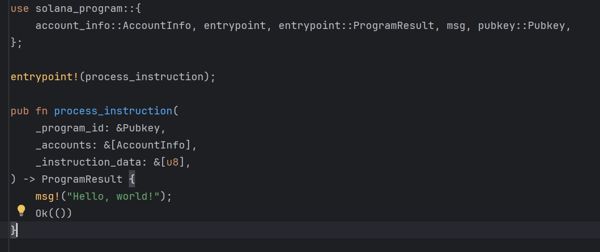
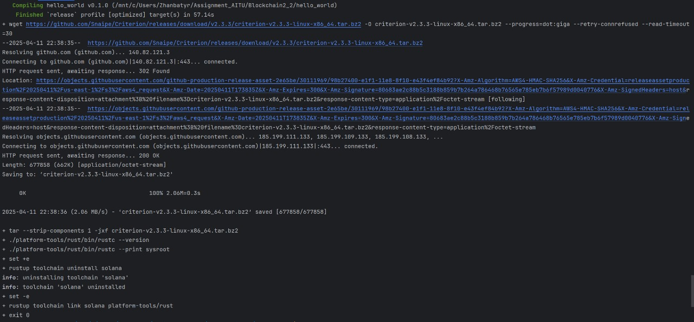

# Solana Hello World
This project demonstrates how to build, deploy, and interact with a simple Solana smart contract using Rust. It's a basic "Hello World" program running on Solana's Devnet.

## **Prerequisites**
* [Rust](https://www.rust-lang.org/)
* [Solana CLI](https://solana.com/ru/docs/intro/installation)
* Git
* RustRover

## **Install Solana CLI**
Solana CLI was installed using the official installation script:

```bash
sh -c "$(curl -sSfL https://release.solana.com/stable/install)"
```


## **Hello World Example**
*Project structure:*


## **Build the Program**
Built the smart contract with:

```bash
cargo build-bpf
```

*Build successful:*




## **Configure Devnet and Deploy**
Set Solana to use Devnet:

```bash
solana config set --url https://api.devnet.solana.com
```

Deployed the program with:

```bash
solana program deploy dist/program/helloworld.so
```


## **Wallet & Program Info**
Wallet address:


## **Resources**
* [Solana Docs](https://solana.com/docs)
* [Solana CLI](https://docs.solana.com/cli)
* [Solana Hello World Example](https://github.com/solana-labs/example-helloworld)

## **Authors**
Moldabek Zhanbatyr

Nadir Shugay

Dias Makhatov# Blockchain2_2
